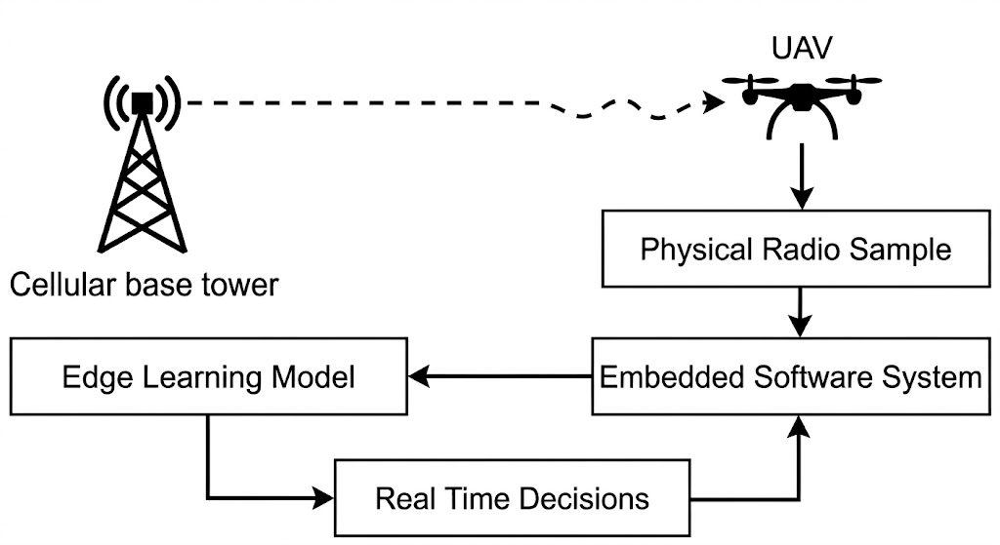
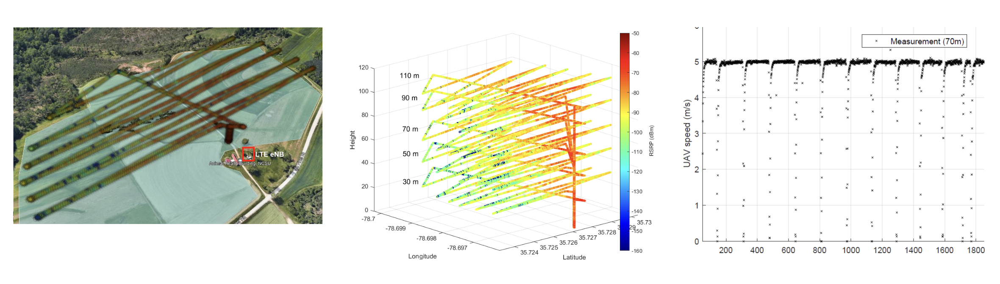
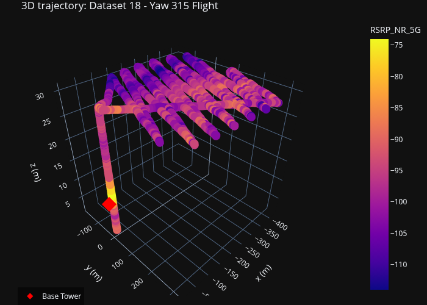
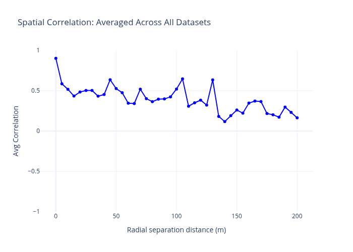
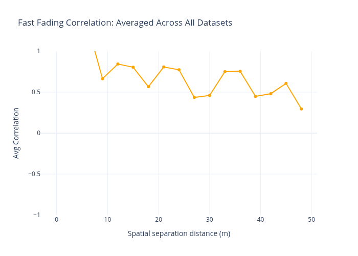
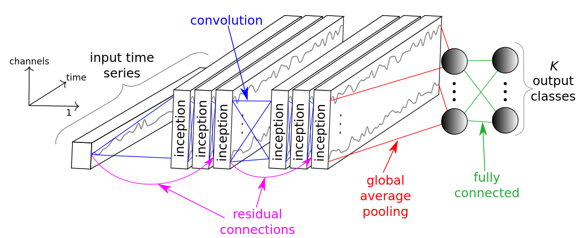
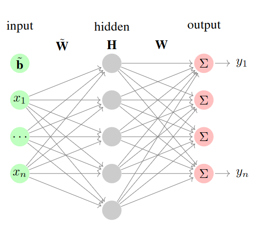
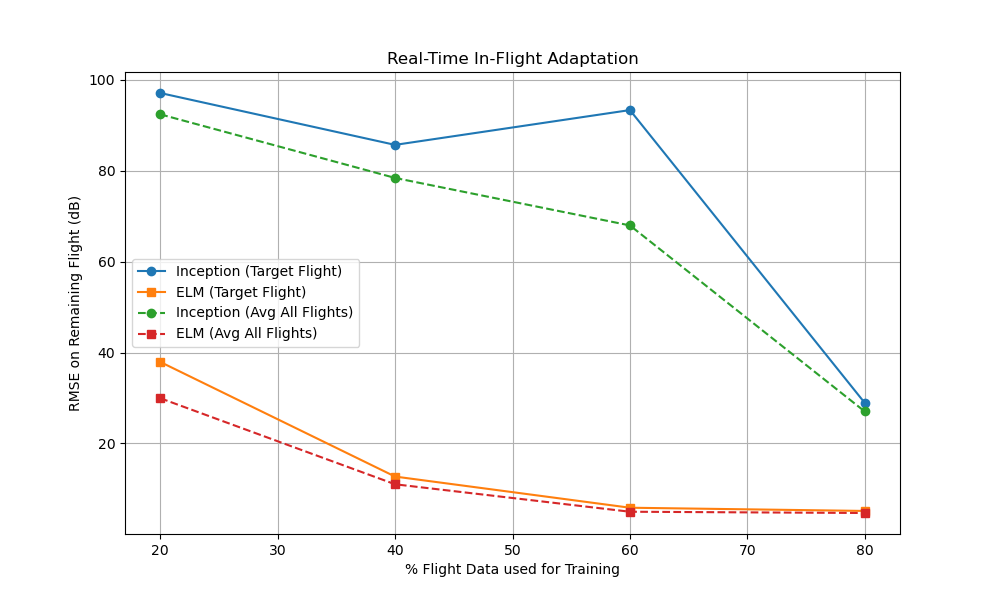

# 3D Radio Environment Map Modeling for Aerial Wireless Networks

**Graduate Project & Report** | Virginia Tech | M.Eng. in Computer Engineering Candidate
**Author:** Ryan Frost
**Collaborators:** Shadab & Dr. Haihan
**Advisor:** Dr. Liu

---

## Project Overview

This project explores the integration of Unmanned Aerial Vehicles (UAVs) in rapidly deploying wireless networks. UAVs are critical for establishing communication in unique scenarios such as disaster relief, remote areas, and tactical operations where traditional ground infrastructure is unavailable.

<p align="center">
  
  <br>
  <em>Cyber-Physical UAV Integrated System</em>
</p>

## Problem Space

Providing connection to the widest area using UAVs introduces unique challenges compared to standard ground-based networks:
- **3D Environment:** Varying altitude adds a new dimension to Radio Environment Map (REM) modeling.
- **Data Scarcity:** Operating in novel or changing environments means historical samples are sparse.
- **Resource Constraints:** UAVs have limited onboard power and compute capacity.

<p align="center">
  
  <br>
  <em>3D Environment Map Sampling using UAVs</em>
</p>

## Methodology & Phases

This 5-month project was structured into four distinct phases to tackle the challenges of modeling aerial networks:

### 1. AERPAW Dataset Analysis
Instead of relying solely on simulated digital twins, we utilized real-world data from NC State's Aerial Experimentation and Research Platform for Advanced Wireless (AERPAW). We analyzed 28 published datasets and downselected UAV-based flights with 3D trajectories and recorded Reference Signal Received Power (RSRP) values (specifically Datasets 18, 22, and 24).

<p align="center">
  
</p>

### 2. Data Processing Pipeline
A custom processing pipeline was developed to standardize datasets and evaluate spatial and fast-fading correlations. This step identified that nearby datapoints (in space and time) have higher RSRP correlation, confirming the opportunity for a machine learning model to effectively learn the environment.

<p align="center">
  
  
</p>

### 3. Machine Learning Pipeline
To establish a baseline, we modeled the environment using a traditional **Line of Sight Path Loss** equation, which yielded a high RMSE of 17.49 dB. 

We then implemented a PyTorch data loader and utilized an **InceptionTime** deep learning model. This model significantly improved performance (RMSE of 3.65 dB), proving that deep learning methods can effectively model the nuances of the REM.

<p align="center">
  
</p>

### 4. Extreme Learning Machine (ELM) for Edge Compute
Deep learning models (like Inception) are computationally expensive and power-hungry, making them ill-suited for onboard UAV training. To address this, we explored an **Extreme Learning Machine (ELM)**—a lightweight model with a random hidden layer that relies on a fast Moore-Penrose generalized inverse optimization.

<p align="center">
  
</p>

## Key Results & Metrics

The ELM demonstrated exceptional capability for **real-time, in-flight learning** under limited compute and sparse data constraints:
- **Faster Training:** ELM fits in fractions of a second (~0.1s) compared to Inception (~60s+).
- **Higher Accuracy with Sparse Data:** At very low sample counts, ELM achieved better RMSE than the deep learning baseline.
- **Edge-Viable:** The negligible compute footprint makes ELM ideal for in-flight recalibration as the UAV encounters new environments.

<p align="center">
  
  <br>
  <em>Real-Time In-Flight Learning Comparison (ELM vs Inception)</em>
</p>

## Installation & Usage

The project uses a standard Python build system (`pyproject.toml`). To set up the environment and run the processing scripts:

1. **Clone the repository and set up a virtual environment:**
   ```bash
   python3 -m venv .venv
   source .venv/bin/activate
   ```

2. **Install the package and its dependencies:**
   ```bash
   pip install -e .
   ```

3. **Run the experiments:**
   The primary machine learning experiments and preprocessing pipelines are located in `src/aerpaw_processing/paper/`.
   ```bash
   # Example: Run the Inception baseline model
   python src/aerpaw_processing/paper/inception_run.py
   
   # Example: Run the learning experiment (ELM vs Inception)
   python src/aerpaw_processing/paper/learning_experiment.py
   ```
