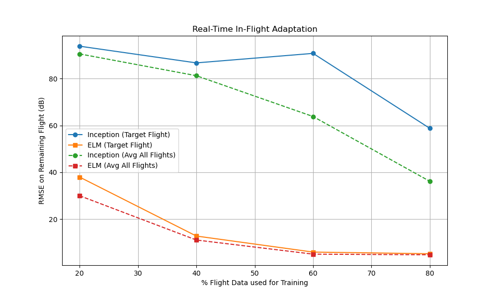

# Learning Report: UAV RSRP Prediction Evolution

This report summarizes the transition from physics-based path loss models to deep learning and lightweight edge models for UAV-based 5G RSRP prediction.

## Experiment Configuration
- **Master Seed**: 42
- **Device**: cuda
- **Total Samples (Global)**: 9927
- **Test Samples (Global, Unseen)**: 1490

## 1. Physics Baseline: Line of Sight (FSPL)
- **Test RMSE**: 17.4918 dB
- **Inference Time**: 0.2766 ms/sample

## 2. Sample Scarcity & Convergence Speed
This section shows how much data is required for InceptionTime to reach a target accuracy of **5.0 dB RMSE**.

| Samples | Test RMSE | Epochs to Target | Train Time (s) |
|---------|-----------|------------------|----------------|
| 100 | 4.1208 | 38 | 66.25 |
| 500 | 3.7646 | 38 | 75.26 |
| 1000 | 4.1965 | 29 | 66.14 |
| 2000 | 5.0473 | 22 | 62.89 |
| 6948 | 4.2300 | 13 | 74.30 |

**100-Epoch Limit Run (All Samples):**
- **Test RMSE**: 3.6468 dB
- **Epochs Run**: 100
- **Train Time**: 577.36 s

## 3. Lightweight Edge Model: ELM
ELM results on the same global sample constraints.

| Samples | Test RMSE | Fit Time (s) |
|---------|-----------|--------------|
| 100 | 7.7501 | 0.0950 |
| 500 | 4.1769 | 0.1517 |
| 1000 | 3.9045 | 0.4981 |
| 2000 | 3.7208 | 3.5166 |
| 6948 | 3.8771 | 2.2450 |

## 4. Real-Time In-Flight Scenario
**Target Flight**: `Dataset_24_PawPrints_5G_30m_Flight_2.csv`
This experiment simulates a UAV collecting data and adapting its model mid-flight. Results are shown for the specific target flight and as an average across all 7 available flights.

### Target Flight: `Dataset_24_PawPrints_5G_30m_Flight_2.csv`
| % Train | Inc RMSE | ELM RMSE | Inc Train (s) | ELM Fit (s) | Inc Inf (ms) | ELM Inf (ms) |
|---------|----------|----------|---------------|-------------|--------------|--------------|
| 20% | 97.0953 | 37.9405 | 1.87 | 0.0333 | 0.3427 | 0.2165 |
| 40% | 85.6834 | 12.7268 | 3.74 | 0.0670 | 0.3585 | 0.2259 |
| 60% | 93.3388 | 5.8723 | 5.61 | 0.0977 | 0.3788 | 0.2295 |
| 80% | 28.9217 | 5.1637 | 7.49 | 0.1520 | 0.4784 | 0.2551 |

### Average Across All Flights
| % Train | Inc RMSE | ELM RMSE | Inc Train (s) | ELM Fit (s) | Inc Inf (ms) | ELM Inf (ms) |
|---------|----------|----------|---------------|-------------|--------------|--------------|
| 20% | 92.4061 | 29.9600 | 4.44 | 0.0873 | 0.3370 | 0.2190 |
| 40% | 78.4127 | 11.0304 | 8.62 | 1.0688 | 0.3503 | 0.2304 |
| 60% | 67.9661 | 4.9897 | 12.84 | 1.1330 | 0.3556 | 0.2257 |
| 80% | 27.0395 | 4.7115 | 17.05 | 2.0811 | 0.3860 | 0.2411 |

## 5. Visual Summary

*Figure: Accuracy improvement as the UAV collects more data. Solid lines represent the target flight, dashed lines represent the average across all flights.*

## Reproducibility
To recreate these exact results, run the following command:
```bash
python src/aerpaw_processing/paper/learning_experiment.py --seed 42 --flight Dataset_24_PawPrints_5G_30m_Flight_2.csv
```
