# Preprocessing Report

Generated on: 2026-03-25 14:20:43

## Step: read_data

- **Total files read**: 29

### Datasets Read

| Dataset | Tech | Flight | Filepath | Rows | Cols |
| --- | --- | --- | --- | --- | --- |
| 18 | LTE_4G | Yaw 315 Flight | Ericsson_Amir/Dryad/yaw315/inputf1_cellid_with_header.csv | 2,898 | 6 |
| 18 | LTE_4G | Yaw 315 Flight | Ericsson_Amir/Dryad/yaw315/inputf1_rsrp_with_header.csv | 2,898 | 6 |
| 18 | LTE_4G | Yaw 315 Flight | Ericsson_Amir/Dryad/yaw315/inputf1_sinr_with_header.csv | 2,898 | 6 |
| 18 | NR_5G | Yaw 315 Flight | Ericsson_Amir/Dryad/yaw315/inputf2_cellid_with_header.csv | 2,898 | 6 |
| 18 | NR_5G | Yaw 315 Flight | Ericsson_Amir/Dryad/yaw315/inputf2_cqi_with_header.csv | 2,898 | 6 |
| 18 | NR_5G | Yaw 315 Flight | Ericsson_Amir/Dryad/yaw315/inputf2_mcs_with_header.csv | 2,898 | 6 |
| 18 | NR_5G | Yaw 315 Flight | Ericsson_Amir/Dryad/yaw315/inputf2_ri_with_header.csv | 2,898 | 6 |
| 18 | NR_5G | Yaw 315 Flight | Ericsson_Amir/Dryad/yaw315/inputf2_rsrp_with_header.csv | 2,898 | 6 |
| 18 | NR_5G | Yaw 315 Flight | Ericsson_Amir/Dryad/yaw315/inputf2_sinr_with_header.csv | 2,898 | 6 |
| 18 | NR_5G | Yaw 315 Flight | Ericsson_Amir/Dryad/yaw315/input_throughput_with_header.csv | 786 | 6 |
| 18 | LTE_4G | Yaw 45 Flight | Ericsson_Amir/Dryad/yaw45/inputf1_cellid_with_header.csv | 2,949 | 6 |
| 18 | LTE_4G | Yaw 45 Flight | Ericsson_Amir/Dryad/yaw45/inputf1_rsrp_with_header.csv | 2,949 | 6 |
| 18 | LTE_4G | Yaw 45 Flight | Ericsson_Amir/Dryad/yaw45/inputf1_sinr_with_header.csv | 2,949 | 6 |
| 18 | NR_5G | Yaw 45 Flight | Ericsson_Amir/Dryad/yaw45/inputf2_cellid_with_header.csv | 2,949 | 6 |
| 18 | NR_5G | Yaw 45 Flight | Ericsson_Amir/Dryad/yaw45/inputf2_cqi_with_header.csv | 2,949 | 6 |
| 18 | NR_5G | Yaw 45 Flight | Ericsson_Amir/Dryad/yaw45/inputf2_mcs_with_header.csv | 2,949 | 6 |
| 18 | NR_5G | Yaw 45 Flight | Ericsson_Amir/Dryad/yaw45/inputf2_ri_with_header.csv | 2,949 | 6 |
| 18 | NR_5G | Yaw 45 Flight | Ericsson_Amir/Dryad/yaw45/inputf2_rsrp_with_header.csv | 2,949 | 6 |
| 18 | NR_5G | Yaw 45 Flight | Ericsson_Amir/Dryad/yaw45/inputf2_sinr_with_header.csv | 2,949 | 6 |
| 18 | NR_5G | Yaw 45 Flight | Ericsson_Amir/Dryad/yaw45/input_throughput_with_header.csv | 818 | 6 |
| 22 | LTE_4G | 4G LTE Flight | Logs/lte.csv | 2,021 | 23 |
| 24 | NR_5G | Nemo 5G 30m Flight 1 | Logs/nemo_5G_NR_altitude30m_flight1.csv | 30,730 | 282 |
| 24 | NR_5G | Nemo 5G 30m Flight 2 | Logs/nemo_5G_NR_altitude30m_flight2.csv | 30,981 | 283 |
| 24 | LTE_4G | PawPrints 4G 30m Flight 1 | Logs/pawprints_4G_LTE_altitude30m_flight1.csv | 2,421 | 29 |
| 24 | LTE_4G | PawPrints 4G 30m Flight 2 | Logs/pawprints_4G_LTE_altitude30m_flight2.csv | 2,078 | 30 |
| 24 | LTE_4G | PawPrints 4G 50m Flight | Logs/pawprints_4G_LTE_altitude50m.csv | 1,533 | 29 |
| 24 | NR_5G | PawPrints 5G 30m Flight 1 | Logs/pawprints_5G_NR_altitude30m_flight1.csv | 791 | 14 |
| 24 | NR_5G | PawPrints 5G 30m Flight 2 | Logs/pawprints_5G_NR_altitude30m_flight2.csv | 731 | 18 |
| 24 | NR_5G | PawPrints 5G 50m Flight | Logs/pawprints_5G_NR_altitude50m.csv | 709 | 14 |


## Step: rename_columns

- Columns renamed to standard names using `alias_map`.

### Columns Renamed per Dataset

| Dataset | Tech | Flight | Filepath | Cols Changed |
| --- | --- | --- | --- | --- |
| 18 | LTE_4G | Yaw 315 Flight | Ericsson_Amir/Dryad/yaw315/inputf1_cellid_with_header.csv | 2 |
| 18 | LTE_4G | Yaw 315 Flight | Ericsson_Amir/Dryad/yaw315/inputf1_rsrp_with_header.csv | 2 |
| 18 | LTE_4G | Yaw 315 Flight | Ericsson_Amir/Dryad/yaw315/inputf1_sinr_with_header.csv | 2 |
| 18 | NR_5G | Yaw 315 Flight | Ericsson_Amir/Dryad/yaw315/inputf2_cellid_with_header.csv | 2 |
| 18 | NR_5G | Yaw 315 Flight | Ericsson_Amir/Dryad/yaw315/inputf2_cqi_with_header.csv | 2 |
| 18 | NR_5G | Yaw 315 Flight | Ericsson_Amir/Dryad/yaw315/inputf2_mcs_with_header.csv | 2 |
| 18 | NR_5G | Yaw 315 Flight | Ericsson_Amir/Dryad/yaw315/inputf2_ri_with_header.csv | 2 |
| 18 | NR_5G | Yaw 315 Flight | Ericsson_Amir/Dryad/yaw315/inputf2_rsrp_with_header.csv | 2 |
| 18 | NR_5G | Yaw 315 Flight | Ericsson_Amir/Dryad/yaw315/inputf2_sinr_with_header.csv | 2 |
| 18 | NR_5G | Yaw 315 Flight | Ericsson_Amir/Dryad/yaw315/input_throughput_with_header.csv | 1 |
| 18 | LTE_4G | Yaw 45 Flight | Ericsson_Amir/Dryad/yaw45/inputf1_cellid_with_header.csv | 2 |
| 18 | LTE_4G | Yaw 45 Flight | Ericsson_Amir/Dryad/yaw45/inputf1_rsrp_with_header.csv | 2 |
| 18 | LTE_4G | Yaw 45 Flight | Ericsson_Amir/Dryad/yaw45/inputf1_sinr_with_header.csv | 2 |
| 18 | NR_5G | Yaw 45 Flight | Ericsson_Amir/Dryad/yaw45/inputf2_cellid_with_header.csv | 2 |
| 18 | NR_5G | Yaw 45 Flight | Ericsson_Amir/Dryad/yaw45/inputf2_cqi_with_header.csv | 2 |
| 18 | NR_5G | Yaw 45 Flight | Ericsson_Amir/Dryad/yaw45/inputf2_mcs_with_header.csv | 2 |
| 18 | NR_5G | Yaw 45 Flight | Ericsson_Amir/Dryad/yaw45/inputf2_ri_with_header.csv | 2 |
| 18 | NR_5G | Yaw 45 Flight | Ericsson_Amir/Dryad/yaw45/inputf2_rsrp_with_header.csv | 2 |
| 18 | NR_5G | Yaw 45 Flight | Ericsson_Amir/Dryad/yaw45/inputf2_sinr_with_header.csv | 2 |
| 18 | NR_5G | Yaw 45 Flight | Ericsson_Amir/Dryad/yaw45/input_throughput_with_header.csv | 1 |
| 22 | LTE_4G | 4G LTE Flight | Logs/lte.csv | 18 |
| 24 | NR_5G | Nemo 5G 30m Flight 1 | Logs/nemo_5G_NR_altitude30m_flight1.csv | 15 |
| 24 | NR_5G | Nemo 5G 30m Flight 2 | Logs/nemo_5G_NR_altitude30m_flight2.csv | 15 |
| 24 | LTE_4G | PawPrints 4G 30m Flight 1 | Logs/pawprints_4G_LTE_altitude30m_flight1.csv | 23 |
| 24 | LTE_4G | PawPrints 4G 30m Flight 2 | Logs/pawprints_4G_LTE_altitude30m_flight2.csv | 23 |
| 24 | LTE_4G | PawPrints 4G 50m Flight | Logs/pawprints_4G_LTE_altitude50m.csv | 23 |
| 24 | NR_5G | PawPrints 5G 30m Flight 1 | Logs/pawprints_5G_NR_altitude30m_flight1.csv | 13 |
| 24 | NR_5G | PawPrints 5G 30m Flight 2 | Logs/pawprints_5G_NR_altitude30m_flight2.csv | 16 |
| 24 | NR_5G | PawPrints 5G 50m Flight | Logs/pawprints_5G_NR_altitude50m.csv | 13 |

- **Total standardized columns (sample)**: 6
- **Columns (sample)**: `ID, Timestamp, Longitude, Latitude, Altitude, Cell_ID`


## Step: remove_columns

- Unwanted columns (not defined in CONFIG) removed.

### Columns Removed per Dataset

| Dataset | Tech | Flight | Filepath | Cols Removed | Remaining Columns |
| --- | --- | --- | --- | --- | --- |
| 18 | LTE_4G | Yaw 315 Flight | Ericsson_Amir/Dryad/yaw315/inputf1_cellid_with_header.csv | 2 | `Timestamp, Longitude, Latitude, Altitude` |
| 18 | LTE_4G | Yaw 315 Flight | Ericsson_Amir/Dryad/yaw315/inputf1_rsrp_with_header.csv | 1 | `Timestamp, Longitude, Latitude, Altitude, RSRP` |
| 18 | LTE_4G | Yaw 315 Flight | Ericsson_Amir/Dryad/yaw315/inputf1_sinr_with_header.csv | 1 | `Timestamp, Longitude, Latitude, Altitude, SINR` |
| 18 | NR_5G | Yaw 315 Flight | Ericsson_Amir/Dryad/yaw315/inputf2_cellid_with_header.csv | 2 | `Timestamp, Longitude, Latitude, Altitude` |
| 18 | NR_5G | Yaw 315 Flight | Ericsson_Amir/Dryad/yaw315/inputf2_cqi_with_header.csv | 2 | `Timestamp, Longitude, Latitude, Altitude` |
| 18 | NR_5G | Yaw 315 Flight | Ericsson_Amir/Dryad/yaw315/inputf2_mcs_with_header.csv | 2 | `Timestamp, Longitude, Latitude, Altitude` |
| 18 | NR_5G | Yaw 315 Flight | Ericsson_Amir/Dryad/yaw315/inputf2_ri_with_header.csv | 2 | `Timestamp, Longitude, Latitude, Altitude` |
| 18 | NR_5G | Yaw 315 Flight | Ericsson_Amir/Dryad/yaw315/inputf2_rsrp_with_header.csv | 1 | `Timestamp, Longitude, Latitude, Altitude, RSRP` |
| 18 | NR_5G | Yaw 315 Flight | Ericsson_Amir/Dryad/yaw315/inputf2_sinr_with_header.csv | 1 | `Timestamp, Longitude, Latitude, Altitude, SINR` |
| 18 | NR_5G | Yaw 315 Flight | Ericsson_Amir/Dryad/yaw315/input_throughput_with_header.csv | 2 | `Timestamp, Longitude, Latitude, Altitude` |
| 18 | LTE_4G | Yaw 45 Flight | Ericsson_Amir/Dryad/yaw45/inputf1_cellid_with_header.csv | 2 | `Timestamp, Longitude, Latitude, Altitude` |
| 18 | LTE_4G | Yaw 45 Flight | Ericsson_Amir/Dryad/yaw45/inputf1_rsrp_with_header.csv | 1 | `Timestamp, Longitude, Latitude, Altitude, RSRP` |
| 18 | LTE_4G | Yaw 45 Flight | Ericsson_Amir/Dryad/yaw45/inputf1_sinr_with_header.csv | 1 | `Timestamp, Longitude, Latitude, Altitude, SINR` |
| 18 | NR_5G | Yaw 45 Flight | Ericsson_Amir/Dryad/yaw45/inputf2_cellid_with_header.csv | 2 | `Timestamp, Longitude, Latitude, Altitude` |
| 18 | NR_5G | Yaw 45 Flight | Ericsson_Amir/Dryad/yaw45/inputf2_cqi_with_header.csv | 2 | `Timestamp, Longitude, Latitude, Altitude` |
| 18 | NR_5G | Yaw 45 Flight | Ericsson_Amir/Dryad/yaw45/inputf2_mcs_with_header.csv | 2 | `Timestamp, Longitude, Latitude, Altitude` |
| 18 | NR_5G | Yaw 45 Flight | Ericsson_Amir/Dryad/yaw45/inputf2_ri_with_header.csv | 2 | `Timestamp, Longitude, Latitude, Altitude` |
| 18 | NR_5G | Yaw 45 Flight | Ericsson_Amir/Dryad/yaw45/inputf2_rsrp_with_header.csv | 1 | `Timestamp, Longitude, Latitude, Altitude, RSRP` |
| 18 | NR_5G | Yaw 45 Flight | Ericsson_Amir/Dryad/yaw45/inputf2_sinr_with_header.csv | 1 | `Timestamp, Longitude, Latitude, Altitude, SINR` |
| 18 | NR_5G | Yaw 45 Flight | Ericsson_Amir/Dryad/yaw45/input_throughput_with_header.csv | 2 | `Timestamp, Longitude, Latitude, Altitude` |
| 22 | LTE_4G | 4G LTE Flight | Logs/lte.csv | 15 | `RSRP, RSRQ, RSSI, TA, Timestamp, Longitude, Latitude, Altitude` |
| 24 | NR_5G | Nemo 5G 30m Flight 1 | Logs/nemo_5G_NR_altitude30m_flight1.csv | 273 | `Timestamp, Longitude, Latitude, Altitude, RSRP, RSRQ, RSSI, SINR, TA` |
| 24 | NR_5G | Nemo 5G 30m Flight 2 | Logs/nemo_5G_NR_altitude30m_flight2.csv | 274 | `Timestamp, Longitude, Latitude, Altitude, RSRP, RSRQ, RSSI, SINR, TA` |
| 24 | LTE_4G | PawPrints 4G 30m Flight 1 | Logs/pawprints_4G_LTE_altitude30m_flight1.csv | 20 | `Timestamp, Longitude, Latitude, Altitude, RSSNR, RSRP, RSRQ, RSSI, TA` |
| 24 | LTE_4G | PawPrints 4G 30m Flight 2 | Logs/pawprints_4G_LTE_altitude30m_flight2.csv | 21 | `Timestamp, Longitude, Latitude, Altitude, RSSNR, RSRP, RSRQ, RSSI, TA` |
| 24 | LTE_4G | PawPrints 4G 50m Flight | Logs/pawprints_4G_LTE_altitude50m.csv | 20 | `Timestamp, Longitude, Latitude, Altitude, RSSNR, RSRP, RSRQ, RSSI, TA` |
| 24 | NR_5G | PawPrints 5G 30m Flight 1 | Logs/pawprints_5G_NR_altitude30m_flight1.csv | 7 | `Timestamp, Longitude, Latitude, Altitude, RSRP, RSRQ, SINR` |
| 24 | NR_5G | PawPrints 5G 30m Flight 2 | Logs/pawprints_5G_NR_altitude30m_flight2.csv | 8 | `Timestamp, Longitude, Latitude, Altitude, CSI_RSRP, CSI_RSRQ, CSI_SINR, RSRP, RSRQ, SINR` |
| 24 | NR_5G | PawPrints 5G 50m Flight | Logs/pawprints_5G_NR_altitude50m.csv | 7 | `Timestamp, Longitude, Latitude, Altitude, RSRP, RSRQ, SINR` |


## Step: combine_tech_files

- Multiple KPI files combined into 13 technology-specific datasets per flight.

### Combined Datasets

| Dataset | Tech | Flight | Rows | Cols | Prev Rows | Columns |
| --- | --- | --- | --- | --- | --- | --- |
| 18 | LTE_4G | Yaw 315 Flight | 2,898 | 6 | 2,898, 2,898, 2,898 | `Timestamp, Longitude, Latitude, Altitude, RSRP, SINR`
| 18 | NR_5G | Yaw 315 Flight | 6,582 | 6 | 2,898, 2,898, 2,898, 2,898, 2,898, 2,898, 786 | `Timestamp, Longitude, Latitude, Altitude, RSRP, SINR`
| 18 | LTE_4G | Yaw 45 Flight | 2,949 | 6 | 2,949, 2,949, 2,949 | `Timestamp, Longitude, Latitude, Altitude, RSRP, SINR`
| 18 | NR_5G | Yaw 45 Flight | 6,716 | 6 | 2,949, 2,949, 2,949, 2,949, 2,949, 2,949, 818 | `Timestamp, Longitude, Latitude, Altitude, RSRP, SINR`
| 22 | LTE_4G | 4G LTE Flight | 2,021 | 8 | 2,021 | `RSRP, RSRQ, RSSI, TA, Timestamp, Longitude, Latitude, Altitude`
| 24 | NR_5G | Nemo 5G 30m Flight 1 | 30,730 | 9 | 30,730 | `Timestamp, Longitude, Latitude, Altitude, RSRP, RSRQ, RSSI, SINR, TA`
| 24 | NR_5G | Nemo 5G 30m Flight 2 | 30,981 | 9 | 30,981 | `Timestamp, Longitude, Latitude, Altitude, RSRP, RSRQ, RSSI, SINR, TA`
| 24 | LTE_4G | PawPrints 4G 30m Flight 1 | 2,421 | 9 | 2,421 | `Timestamp, Longitude, Latitude, Altitude, RSSNR, RSRP, RSRQ, RSSI, TA`
| 24 | LTE_4G | PawPrints 4G 30m Flight 2 | 2,078 | 9 | 2,078 | `Timestamp, Longitude, Latitude, Altitude, RSSNR, RSRP, RSRQ, RSSI, TA`
| 24 | LTE_4G | PawPrints 4G 50m Flight | 1,533 | 9 | 1,533 | `Timestamp, Longitude, Latitude, Altitude, RSSNR, RSRP, RSRQ, RSSI, TA`
| 24 | NR_5G | PawPrints 5G 30m Flight 1 | 791 | 7 | 791 | `Timestamp, Longitude, Latitude, Altitude, RSRP, RSRQ, SINR`
| 24 | NR_5G | PawPrints 5G 30m Flight 2 | 731 | 10 | 731 | `Timestamp, Longitude, Latitude, Altitude, CSI_RSRP, CSI_RSRQ, CSI_SINR, RSRP, RSRQ, SINR`
| 24 | NR_5G | PawPrints 5G 50m Flight | 709 | 7 | 709 | `Timestamp, Longitude, Latitude, Altitude, RSRP, RSRQ, SINR`


## Step: combine_flight_techs

- Multiple technologies combined into 11 single flight datasets.

### Combined Flight Datasets

| Dataset | Flight | Rows | Cols | Techs Combined | Columns |
| --- | --- | --- | --- | --- | --- |
| 18 | Yaw 315 Flight | 6,582 | 8 | LTE_4G, NR_5G | `Timestamp, Longitude, Latitude, Altitude, RSRP_LTE_4G, SINR_LTE_4G, RSRP_NR_5G, SINR_NR_5G`
| 18 | Yaw 45 Flight | 6,716 | 8 | LTE_4G, NR_5G | `Timestamp, Longitude, Latitude, Altitude, RSRP_LTE_4G, SINR_LTE_4G, RSRP_NR_5G, SINR_NR_5G`
| 22 | 4G LTE Flight | 2,021 | 8 | LTE_4G | `RSRP_LTE_4G, RSRQ_LTE_4G, RSSI_LTE_4G, TA_LTE_4G, Timestamp, Longitude, Latitude, Altitude`
| 24 | Nemo 5G 30m Flight 1 | 30,730 | 9 | NR_5G | `Timestamp, Longitude, Latitude, Altitude, RSRP_NR_5G, RSRQ_NR_5G, RSSI_NR_5G, SINR_NR_5G, TA_NR_5G`
| 24 | Nemo 5G 30m Flight 2 | 30,981 | 9 | NR_5G | `Timestamp, Longitude, Latitude, Altitude, RSRP_NR_5G, RSRQ_NR_5G, RSSI_NR_5G, SINR_NR_5G, TA_NR_5G`
| 24 | PawPrints 4G 30m Flight 1 | 2,421 | 9 | LTE_4G | `Timestamp, Longitude, Latitude, Altitude, RSSNR_LTE_4G, RSRP_LTE_4G, RSRQ_LTE_4G, RSSI_LTE_4G, TA_LTE_4G`
| 24 | PawPrints 4G 30m Flight 2 | 2,078 | 9 | LTE_4G | `Timestamp, Longitude, Latitude, Altitude, RSSNR_LTE_4G, RSRP_LTE_4G, RSRQ_LTE_4G, RSSI_LTE_4G, TA_LTE_4G`
| 24 | PawPrints 4G 50m Flight | 1,533 | 9 | LTE_4G | `Timestamp, Longitude, Latitude, Altitude, RSSNR_LTE_4G, RSRP_LTE_4G, RSRQ_LTE_4G, RSSI_LTE_4G, TA_LTE_4G`
| 24 | PawPrints 5G 30m Flight 1 | 791 | 7 | NR_5G | `Timestamp, Longitude, Latitude, Altitude, RSRP_NR_5G, RSRQ_NR_5G, SINR_NR_5G`
| 24 | PawPrints 5G 30m Flight 2 | 731 | 10 | NR_5G | `Timestamp, Longitude, Latitude, Altitude, CSI_RSRP_NR_5G, CSI_RSRQ_NR_5G, CSI_SINR_NR_5G, RSRP_NR_5G, RSRQ_NR_5G, SINR_NR_5G`
| 24 | PawPrints 5G 50m Flight | 709 | 7 | NR_5G | `Timestamp, Longitude, Latitude, Altitude, RSRP_NR_5G, RSRQ_NR_5G, SINR_NR_5G`


## Step: interpolate_to_label

- Interpolated and standardized data around label columns.

### Interpolated Datasets

| Dataset | Flight | Rows | Cols | Prev Rows |
| --- | --- | --- | --- | --- |
| 18 | Yaw 315 Flight | 2,898 | 8 | 6,582 |
| 18 | Yaw 45 Flight | 2,949 | 8 | 6,716 |
| 22 | 4G LTE Flight | 2,021 | 8 | 2,021 |
| 24 | Nemo 5G 30m Flight 1 | 1,598 | 9 | 30,730 |
| 24 | Nemo 5G 30m Flight 2 | 1,599 | 9 | 30,981 |
| 24 | PawPrints 4G 30m Flight 1 | 2,421 | 9 | 2,421 |
| 24 | PawPrints 4G 30m Flight 2 | 2,078 | 9 | 2,078 |
| 24 | PawPrints 4G 50m Flight | 1,533 | 9 | 1,533 |
| 24 | PawPrints 5G 30m Flight 1 | 791 | 7 | 791 |
| 24 | PawPrints 5G 30m Flight 2 | 731 | 10 | 731 |
| 24 | PawPrints 5G 50m Flight | 709 | 7 | 709 |


## Step: project_coordinates

- Projected Latitude/Longitude to x/y coordinates using AEQD projection.
- Base Tower (Origin): LW1 (35.727451, -78.695974)

### Projected 3D Trajectories (Colored by RSRP)

#### Flight: Yaw 315 Flight

[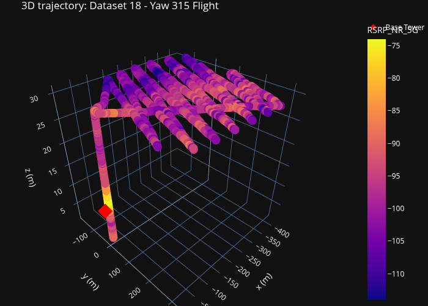](report_assets/dataset_18_Yaw_315_Flight_3d.html)

#### Flight: Yaw 45 Flight

[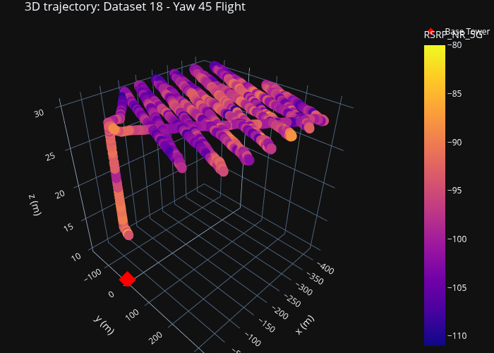](report_assets/dataset_18_Yaw_45_Flight_3d.html)

#### Flight: 4G LTE Flight

[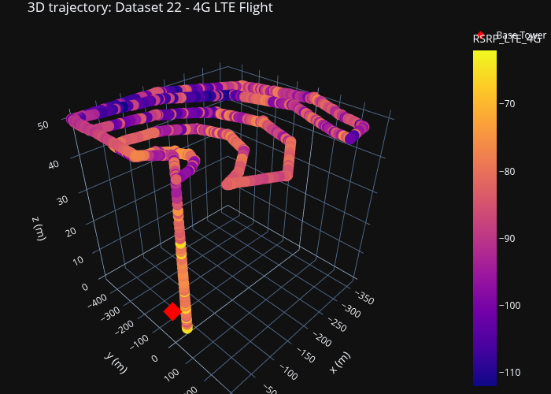](report_assets/dataset_22_4G_LTE_Flight_3d.html)

#### Flight: Nemo 5G 30m Flight 1

[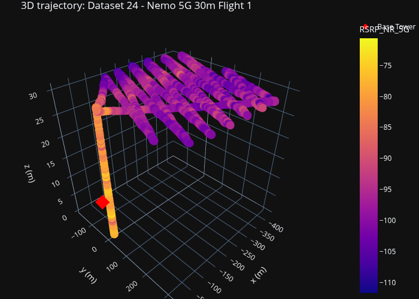](report_assets/dataset_24_Nemo_5G_30m_Flight_1_3d.html)

#### Flight: Nemo 5G 30m Flight 2

[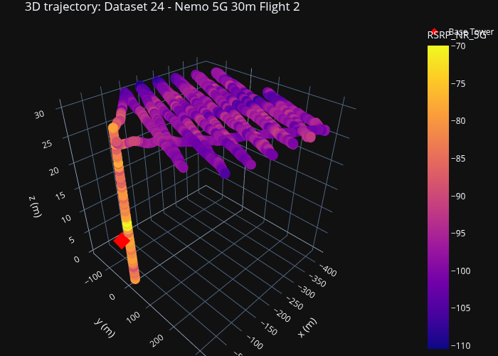](report_assets/dataset_24_Nemo_5G_30m_Flight_2_3d.html)

#### Flight: PawPrints 4G 30m Flight 1

[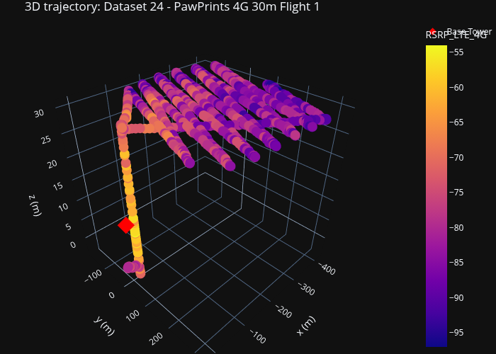](report_assets/dataset_24_PawPrints_4G_30m_Flight_1_3d.html)

#### Flight: PawPrints 4G 30m Flight 2

[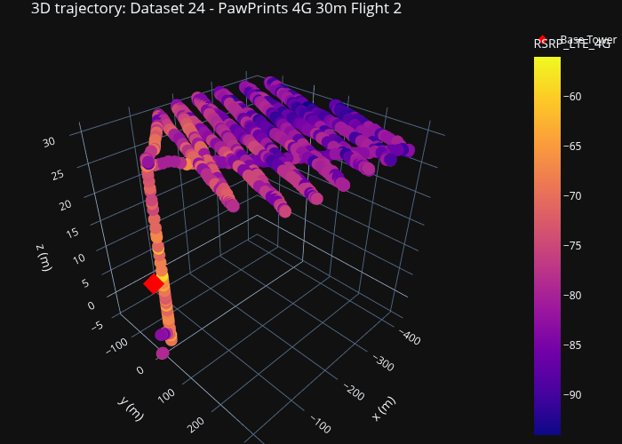](report_assets/dataset_24_PawPrints_4G_30m_Flight_2_3d.html)

#### Flight: PawPrints 4G 50m Flight

[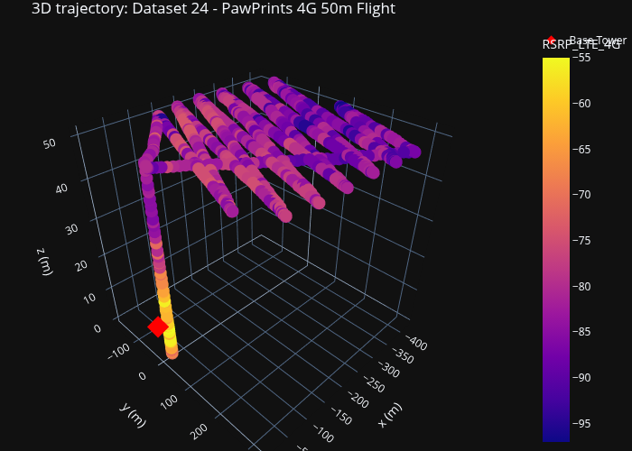](report_assets/dataset_24_PawPrints_4G_50m_Flight_3d.html)

#### Flight: PawPrints 5G 30m Flight 1

[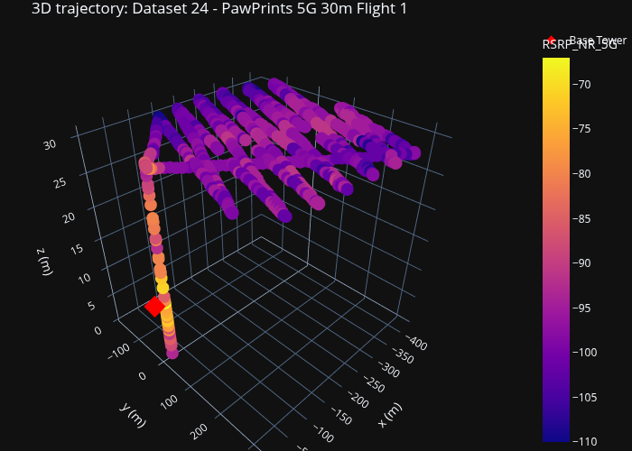](report_assets/dataset_24_PawPrints_5G_30m_Flight_1_3d.html)

#### Flight: PawPrints 5G 30m Flight 2

[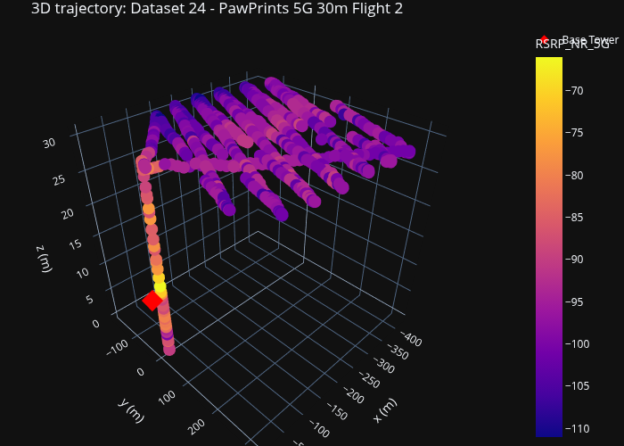](report_assets/dataset_24_PawPrints_5G_30m_Flight_2_3d.html)

#### Flight: PawPrints 5G 50m Flight

[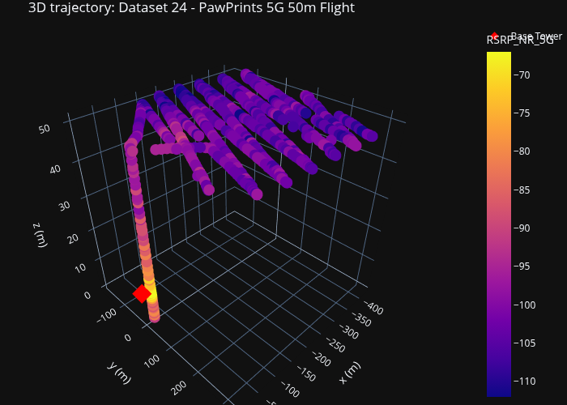](report_assets/dataset_24_PawPrints_5G_50m_Flight_3d.html)


## Step: mad_filter

- Projected Latitude/Longitude to x/y coordinates using AEQD projection.
- Base Tower (Origin): LW1 (35.727451, -78.695974)

### Projected 3D Trajectories (Colored by RSRP)

#### Flight: Yaw 315 Flight

[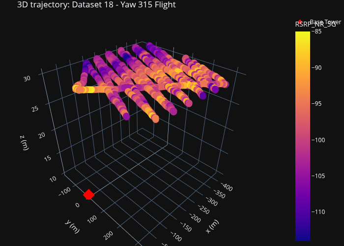](report_assets/dataset_18_Yaw_315_Flight_mad_3d.html)

#### Flight: Yaw 45 Flight

[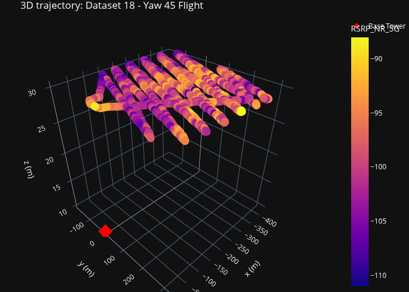](report_assets/dataset_18_Yaw_45_Flight_mad_3d.html)

#### Flight: 4G LTE Flight

[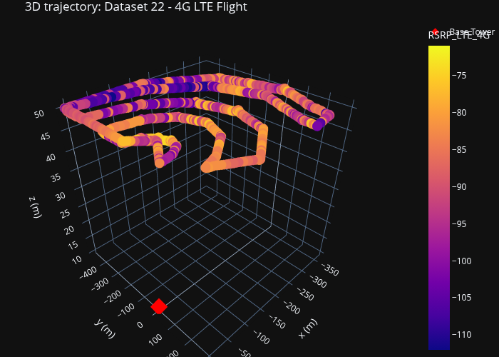](report_assets/dataset_22_4G_LTE_Flight_mad_3d.html)

#### Flight: Nemo 5G 30m Flight 1

[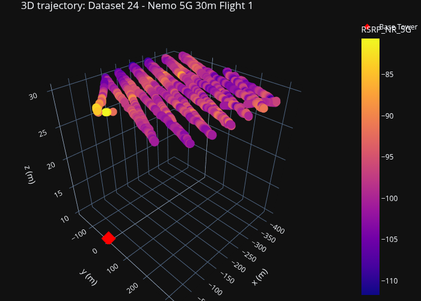](report_assets/dataset_24_Nemo_5G_30m_Flight_1_mad_3d.html)

#### Flight: Nemo 5G 30m Flight 2

[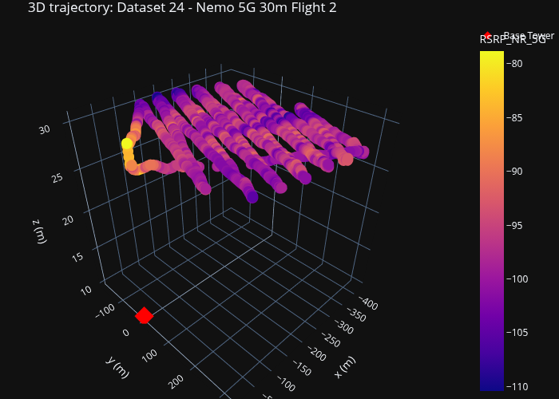](report_assets/dataset_24_Nemo_5G_30m_Flight_2_mad_3d.html)

#### Flight: PawPrints 4G 30m Flight 1

[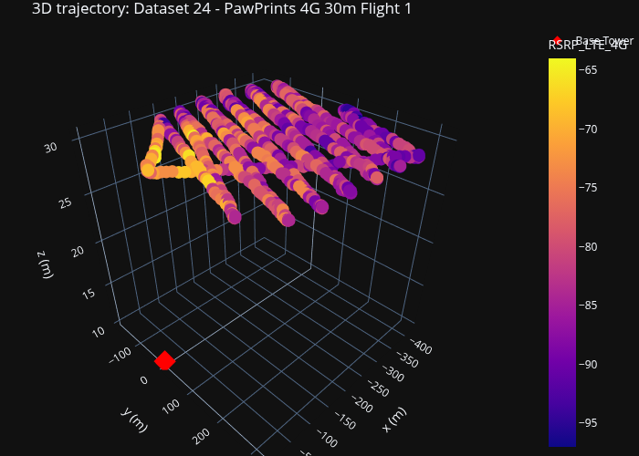](report_assets/dataset_24_PawPrints_4G_30m_Flight_1_mad_3d.html)

#### Flight: PawPrints 4G 30m Flight 2

[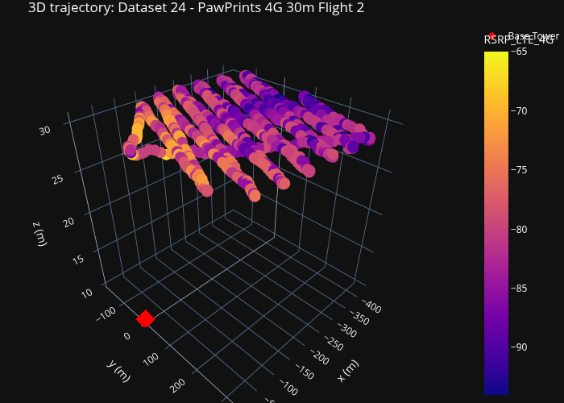](report_assets/dataset_24_PawPrints_4G_30m_Flight_2_mad_3d.html)

#### Flight: PawPrints 4G 50m Flight

[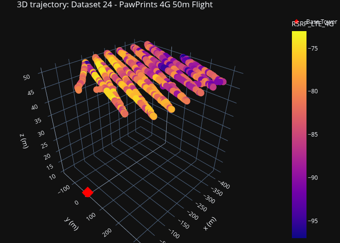](report_assets/dataset_24_PawPrints_4G_50m_Flight_mad_3d.html)

#### Flight: PawPrints 5G 30m Flight 1

[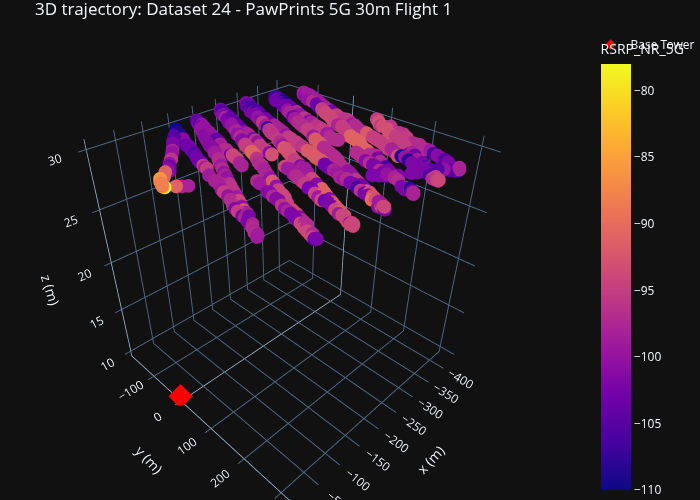](report_assets/dataset_24_PawPrints_5G_30m_Flight_1_mad_3d.html)

#### Flight: PawPrints 5G 30m Flight 2

[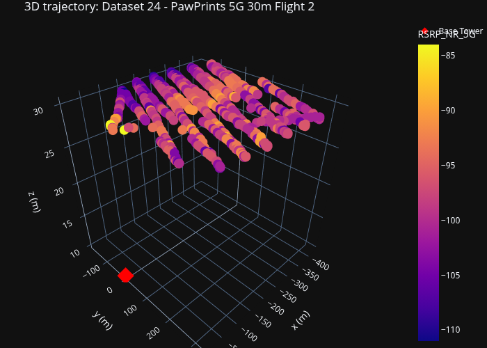](report_assets/dataset_24_PawPrints_5G_30m_Flight_2_mad_3d.html)

#### Flight: PawPrints 5G 50m Flight

[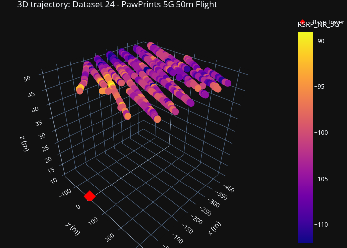](report_assets/dataset_24_PawPrints_5G_50m_Flight_mad_3d.html)


## Step: calculate_bin

- Partitioned the 3D data points into a spherical grid centered at the Base Station with 0.05 rad bins.

### Projected 3D Trajectories (Colored by Angular Bin)

#### Flight: Yaw 315 Flight

[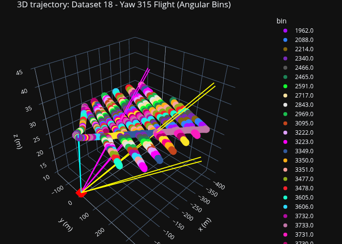](report_assets/dataset_18_Yaw_315_Flight_bin_3d.html)

#### Flight: Yaw 45 Flight

[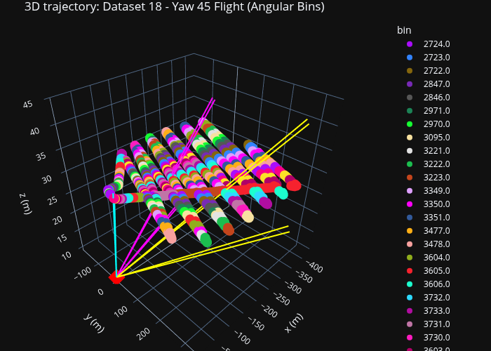](report_assets/dataset_18_Yaw_45_Flight_bin_3d.html)

#### Flight: 4G LTE Flight

[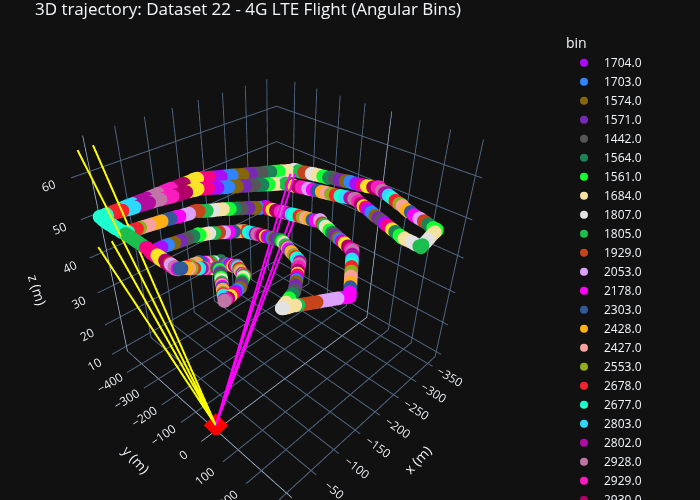](report_assets/dataset_22_4G_LTE_Flight_bin_3d.html)

#### Flight: Nemo 5G 30m Flight 1

[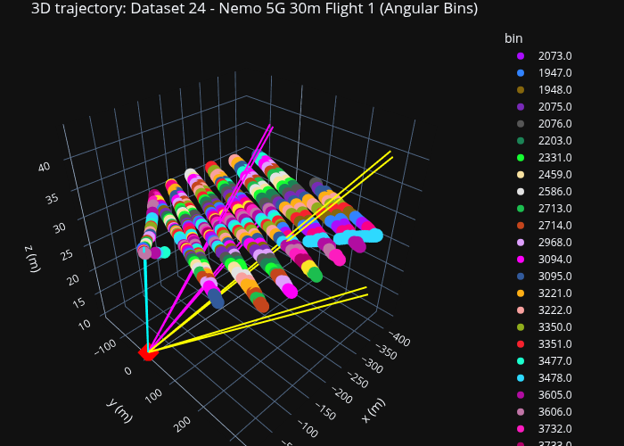](report_assets/dataset_24_Nemo_5G_30m_Flight_1_bin_3d.html)

#### Flight: Nemo 5G 30m Flight 2

[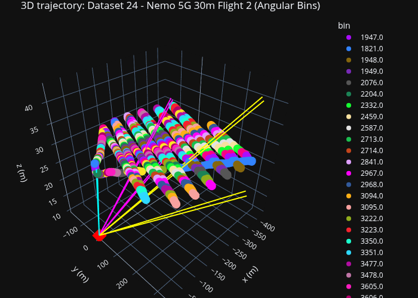](report_assets/dataset_24_Nemo_5G_30m_Flight_2_bin_3d.html)

#### Flight: PawPrints 4G 30m Flight 1

[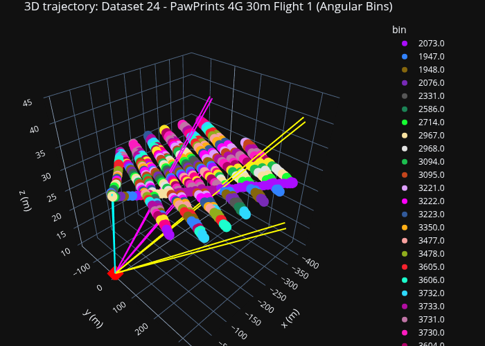](report_assets/dataset_24_PawPrints_4G_30m_Flight_1_bin_3d.html)

#### Flight: PawPrints 4G 30m Flight 2

[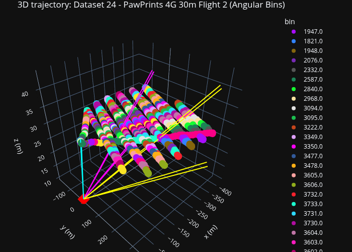](report_assets/dataset_24_PawPrints_4G_30m_Flight_2_bin_3d.html)

#### Flight: PawPrints 4G 50m Flight

[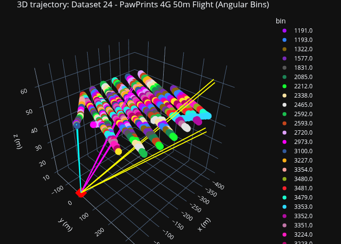](report_assets/dataset_24_PawPrints_4G_50m_Flight_bin_3d.html)

#### Flight: PawPrints 5G 30m Flight 1

[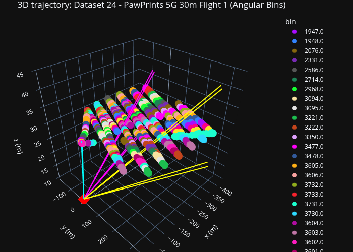](report_assets/dataset_24_PawPrints_5G_30m_Flight_1_bin_3d.html)

#### Flight: PawPrints 5G 30m Flight 2

[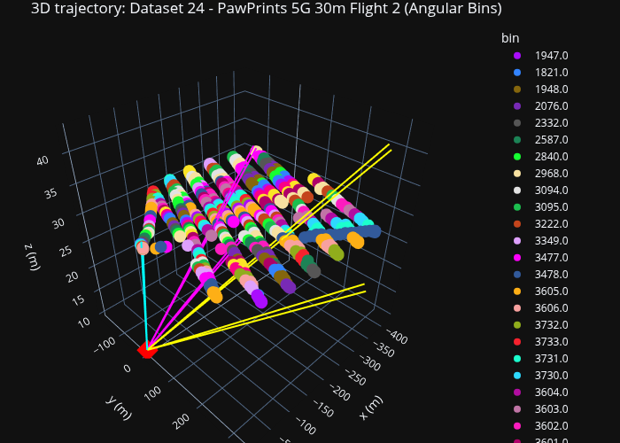](report_assets/dataset_24_PawPrints_5G_30m_Flight_2_bin_3d.html)

#### Flight: PawPrints 5G 50m Flight

[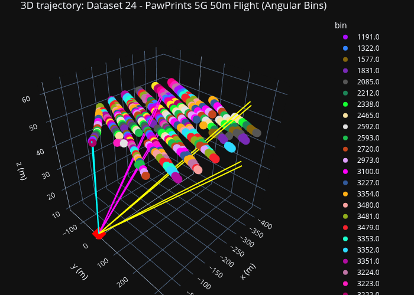](report_assets/dataset_24_PawPrints_5G_50m_Flight_bin_3d.html)


## Step: correlation_computation

- Computed pairwise spatial correlation of RSRP for each angular bin and aggregated by 5m radial separation distance bins.

**Note on Pairwise Point Generation:**
For a bin with `N` points, the correlation is computed between every point and every other point in that *same* bin.
Because we pair every point with every other point, the total number of generated correlation pairs will be much larger than the original data points (Quadratic Growth).

```text
Visual Example (Bin with 4 points: A, B, C, D):
Pairwise combinations (N=4, so N*(N-1)/2 = 6 pairs):
A <-> B
A <-> C
A <-> D
B <-> C
B <-> D
C <-> D
```


### Spatial Correlation Profiles

#### Flight: Yaw 315 Flight

[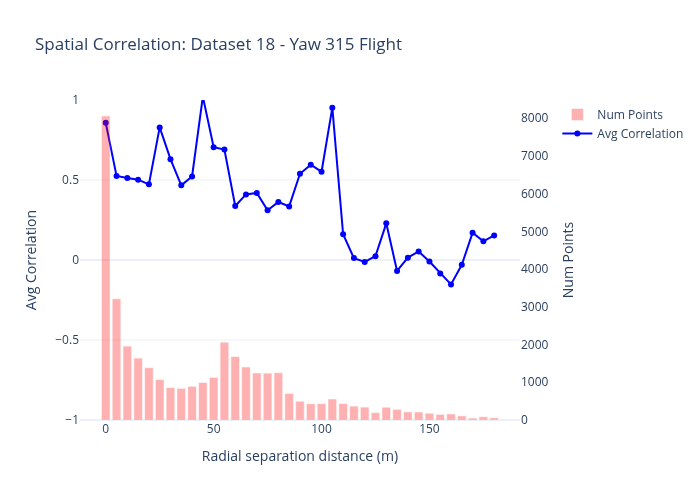](report_assets/dataset_18_Yaw_315_Flight_correlation.html)

#### Flight: Yaw 315 Flight 3D Correlation Bins

[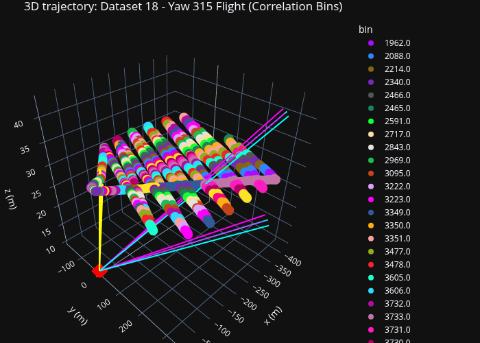](report_assets/dataset_18_Yaw_315_Flight_bin_corr_3d.html)

#### Flight: Yaw 45 Flight

[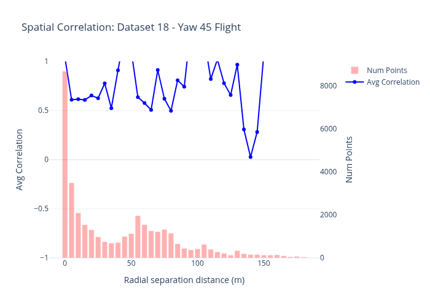](report_assets/dataset_18_Yaw_45_Flight_correlation.html)

#### Flight: Yaw 45 Flight 3D Correlation Bins

[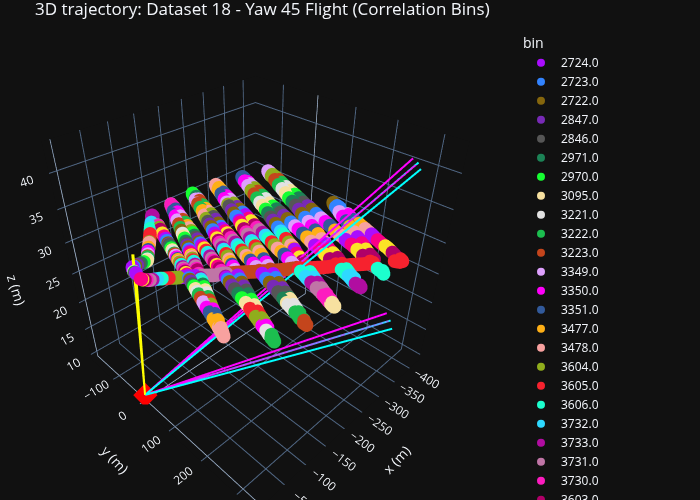](report_assets/dataset_18_Yaw_45_Flight_bin_corr_3d.html)

#### Flight: 4G LTE Flight

[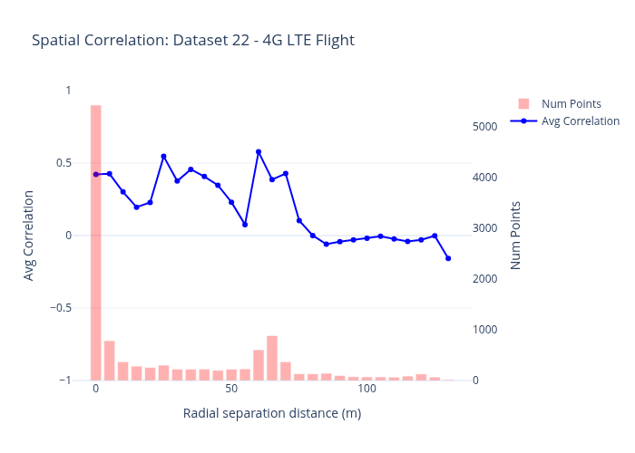](report_assets/dataset_22_4G_LTE_Flight_correlation.html)

#### Flight: 4G LTE Flight 3D Correlation Bins

[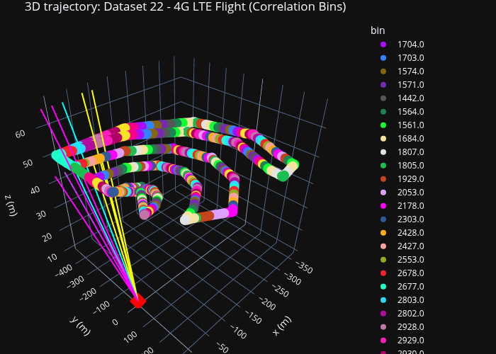](report_assets/dataset_22_4G_LTE_Flight_bin_corr_3d.html)

#### Flight: Nemo 5G 30m Flight 1

[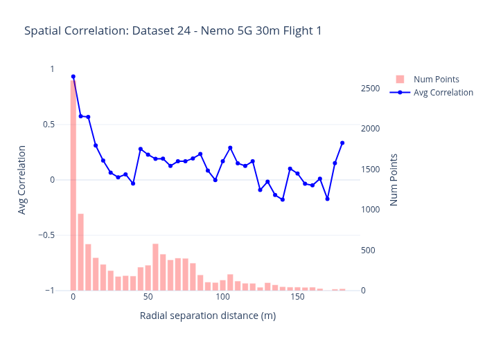](report_assets/dataset_24_Nemo_5G_30m_Flight_1_correlation.html)

#### Flight: Nemo 5G 30m Flight 1 3D Correlation Bins

[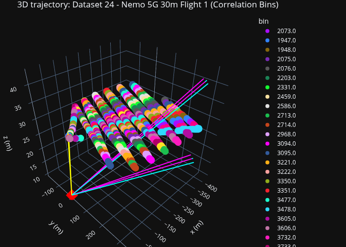](report_assets/dataset_24_Nemo_5G_30m_Flight_1_bin_corr_3d.html)

#### Flight: Nemo 5G 30m Flight 2

[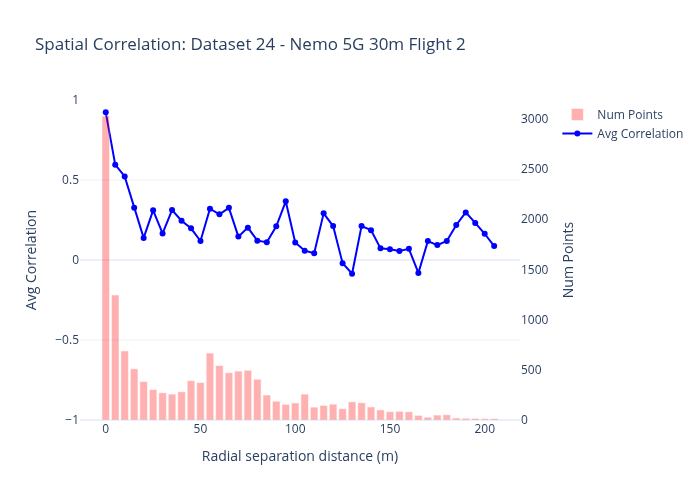](report_assets/dataset_24_Nemo_5G_30m_Flight_2_correlation.html)

#### Flight: Nemo 5G 30m Flight 2 3D Correlation Bins

[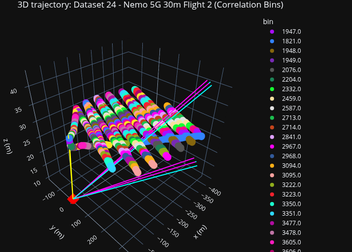](report_assets/dataset_24_Nemo_5G_30m_Flight_2_bin_corr_3d.html)

#### Flight: PawPrints 4G 30m Flight 1

[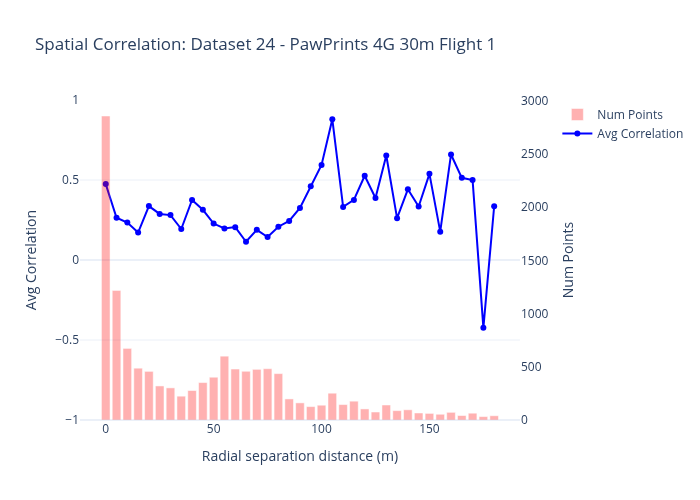](report_assets/dataset_24_PawPrints_4G_30m_Flight_1_correlation.html)

#### Flight: PawPrints 4G 30m Flight 1 3D Correlation Bins

[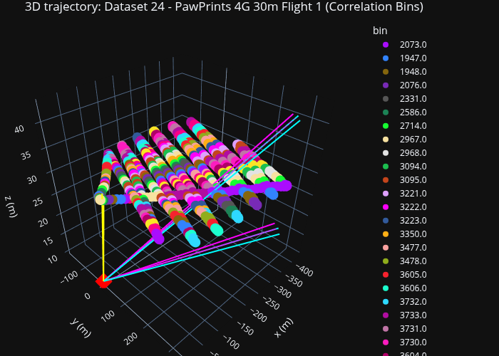](report_assets/dataset_24_PawPrints_4G_30m_Flight_1_bin_corr_3d.html)

#### Flight: PawPrints 4G 30m Flight 2

[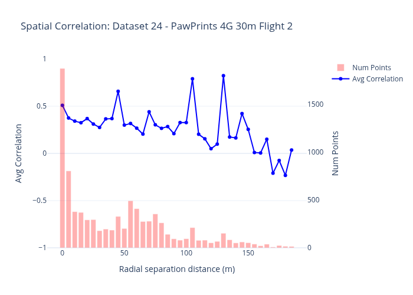](report_assets/dataset_24_PawPrints_4G_30m_Flight_2_correlation.html)

#### Flight: PawPrints 4G 30m Flight 2 3D Correlation Bins

[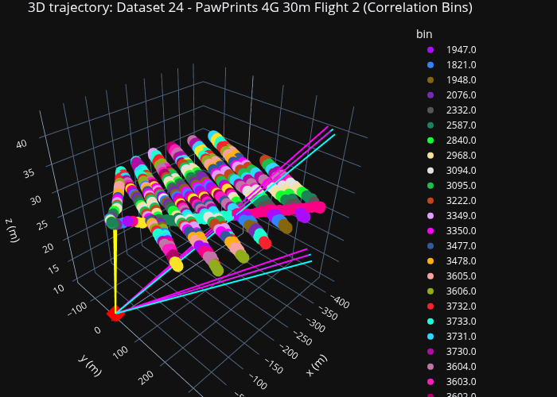](report_assets/dataset_24_PawPrints_4G_30m_Flight_2_bin_corr_3d.html)

#### Flight: PawPrints 4G 50m Flight

[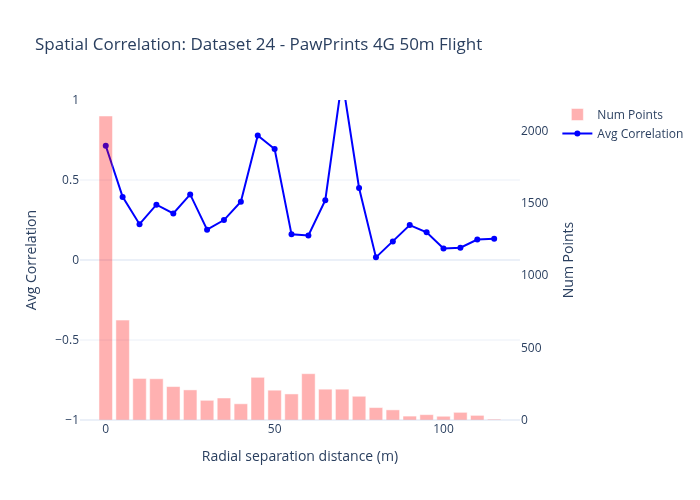](report_assets/dataset_24_PawPrints_4G_50m_Flight_correlation.html)

#### Flight: PawPrints 4G 50m Flight 3D Correlation Bins

[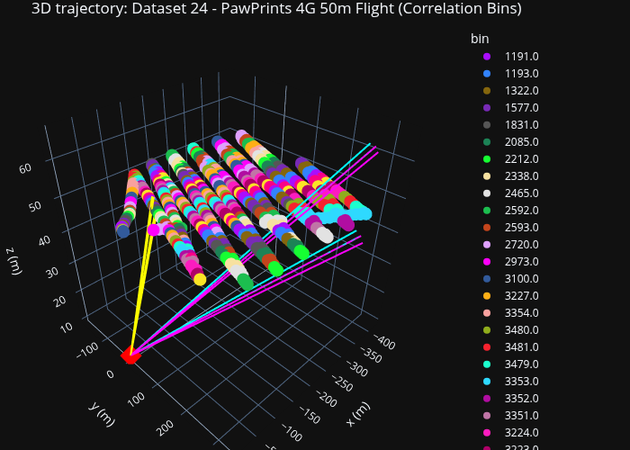](report_assets/dataset_24_PawPrints_4G_50m_Flight_bin_corr_3d.html)

#### Flight: PawPrints 5G 30m Flight 1

[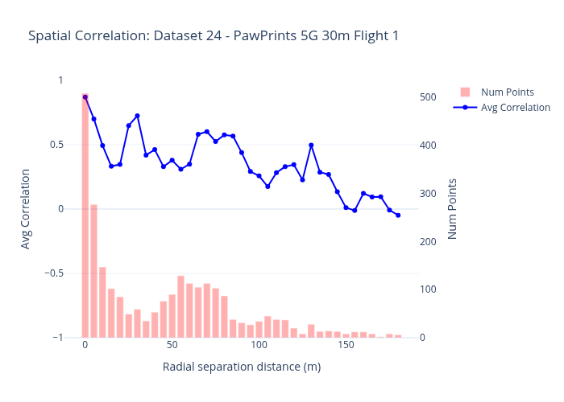](report_assets/dataset_24_PawPrints_5G_30m_Flight_1_correlation.html)

#### Flight: PawPrints 5G 30m Flight 1 3D Correlation Bins

[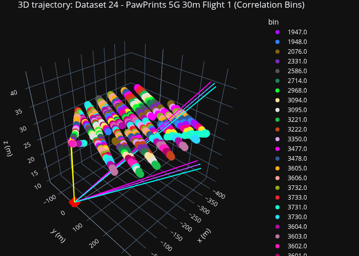](report_assets/dataset_24_PawPrints_5G_30m_Flight_1_bin_corr_3d.html)

#### Flight: PawPrints 5G 30m Flight 2

[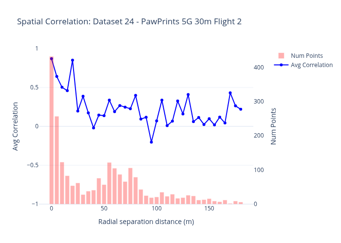](report_assets/dataset_24_PawPrints_5G_30m_Flight_2_correlation.html)

#### Flight: PawPrints 5G 30m Flight 2 3D Correlation Bins

[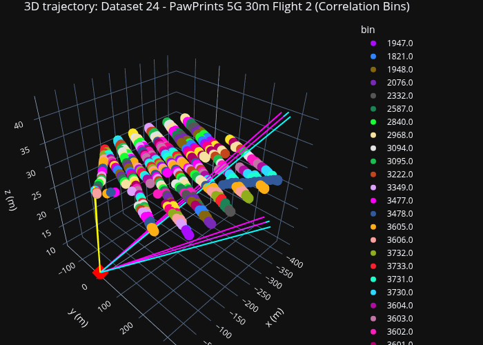](report_assets/dataset_24_PawPrints_5G_30m_Flight_2_bin_corr_3d.html)

#### Flight: PawPrints 5G 50m Flight

[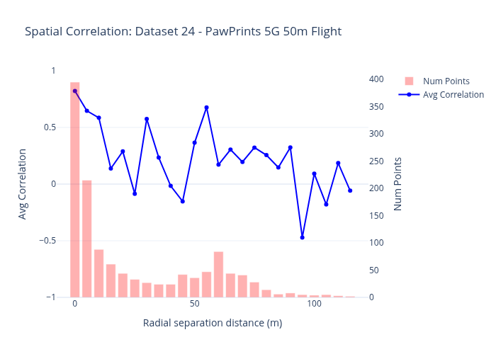](report_assets/dataset_24_PawPrints_5G_50m_Flight_correlation.html)

#### Flight: PawPrints 5G 50m Flight 3D Correlation Bins

[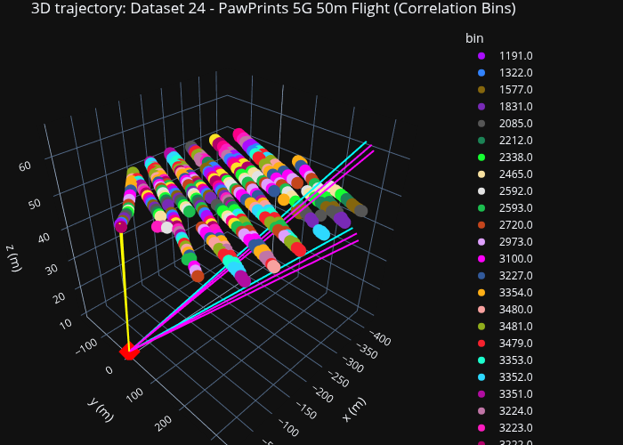](report_assets/dataset_24_PawPrints_5G_50m_Flight_bin_corr_3d.html)

## Step: fast_fading_correlation

- Computed fast fading factor correlation in spatio-temporal domain (Section II.B.2) using a rolling window of 5 prior samples.
- Fast fading `nu` estimated by removing LoS path loss (proportional to -20log10(d3D)) from RSRP.
- Aggregated into spatial separation bins of 3m.

### Fast Fading Spatio-Temporal Correlation Profiles

#### Flight: Yaw 315 Flight

[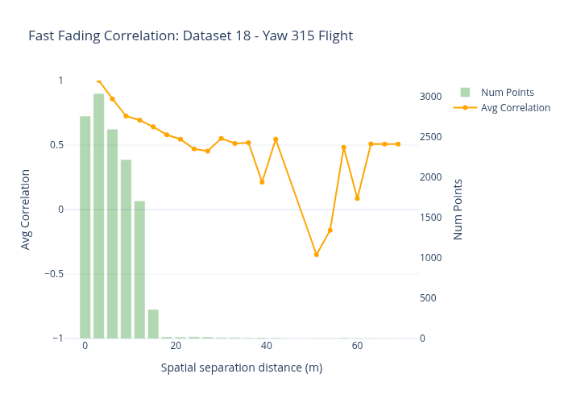](report_assets/dataset_18_Yaw_315_Flight_ff_correlation.html)

#### Flight: Yaw 45 Flight

[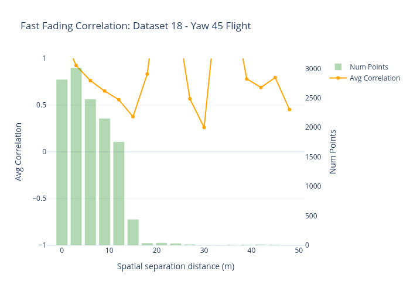](report_assets/dataset_18_Yaw_45_Flight_ff_correlation.html)

#### Flight: 4G LTE Flight

[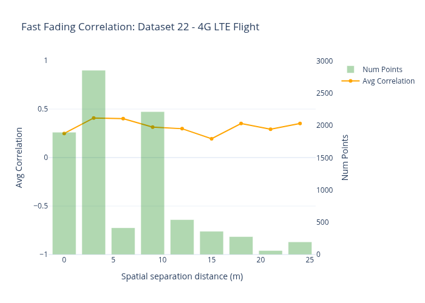](report_assets/dataset_22_4G_LTE_Flight_ff_correlation.html)

#### Flight: Nemo 5G 30m Flight 1

[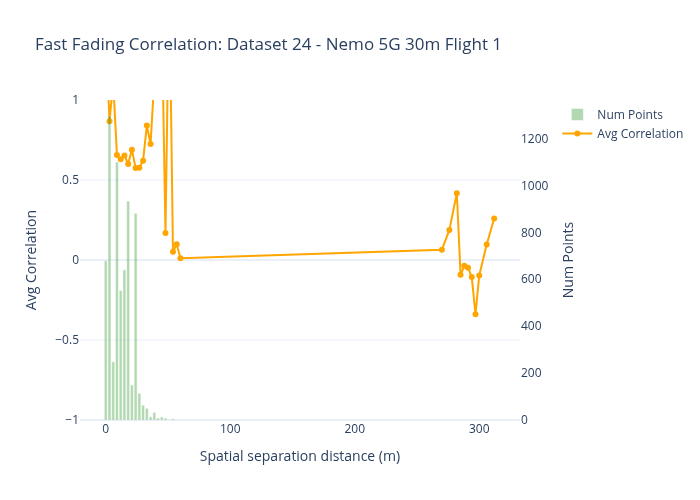](report_assets/dataset_24_Nemo_5G_30m_Flight_1_ff_correlation.html)

#### Flight: Nemo 5G 30m Flight 2

[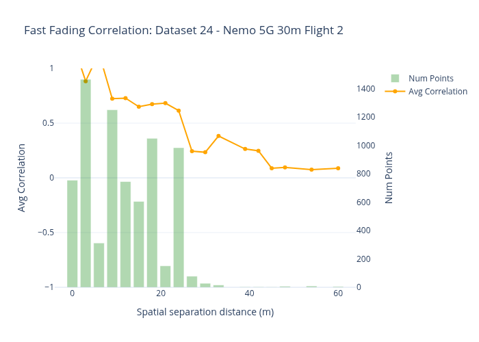](report_assets/dataset_24_Nemo_5G_30m_Flight_2_ff_correlation.html)

#### Flight: PawPrints 4G 30m Flight 1

[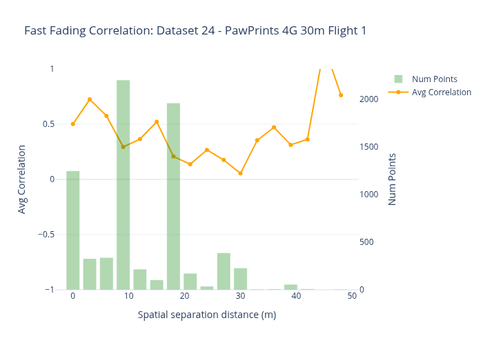](report_assets/dataset_24_PawPrints_4G_30m_Flight_1_ff_correlation.html)

#### Flight: PawPrints 4G 30m Flight 2

[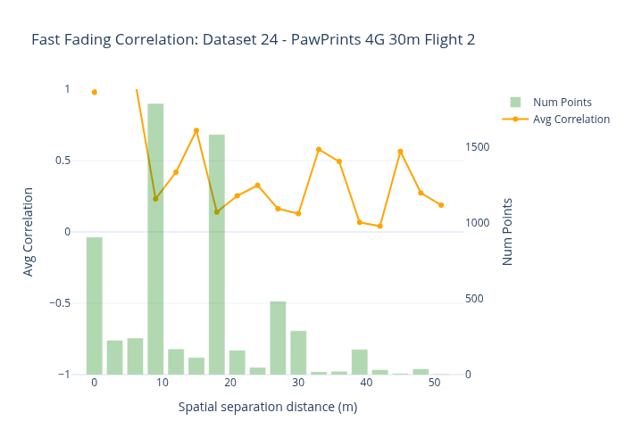](report_assets/dataset_24_PawPrints_4G_30m_Flight_2_ff_correlation.html)

#### Flight: PawPrints 4G 50m Flight

[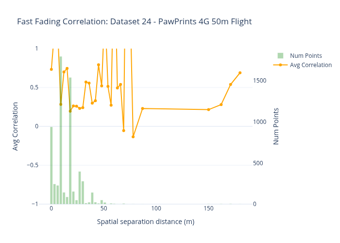](report_assets/dataset_24_PawPrints_4G_50m_Flight_ff_correlation.html)

#### Flight: PawPrints 5G 30m Flight 1

[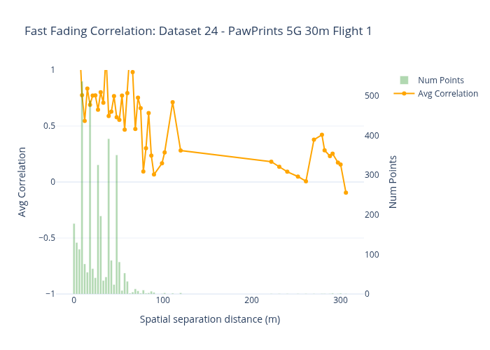](report_assets/dataset_24_PawPrints_5G_30m_Flight_1_ff_correlation.html)

#### Flight: PawPrints 5G 30m Flight 2

[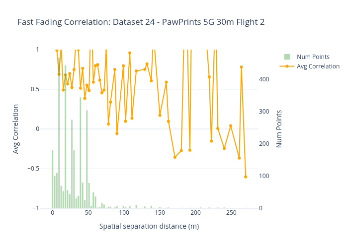](report_assets/dataset_24_PawPrints_5G_30m_Flight_2_ff_correlation.html)

#### Flight: PawPrints 5G 50m Flight

[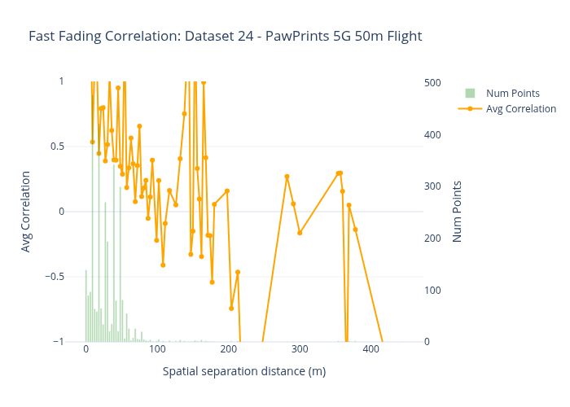](report_assets/dataset_24_PawPrints_5G_50m_Flight_ff_correlation.html)
